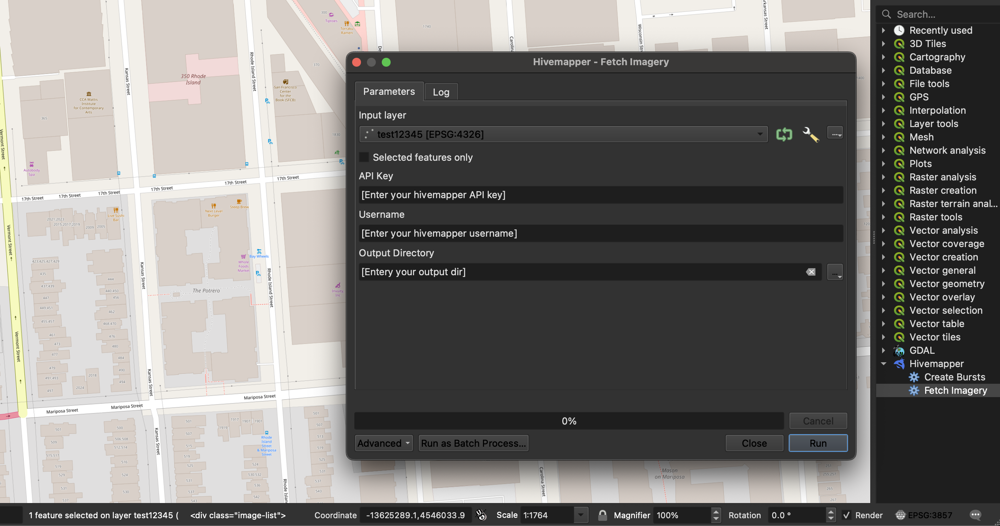
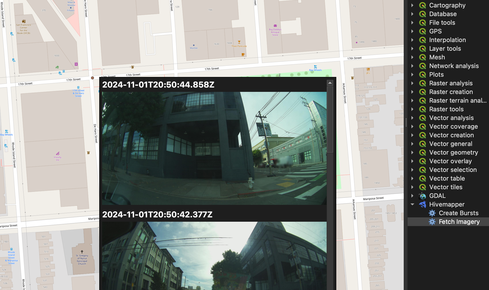
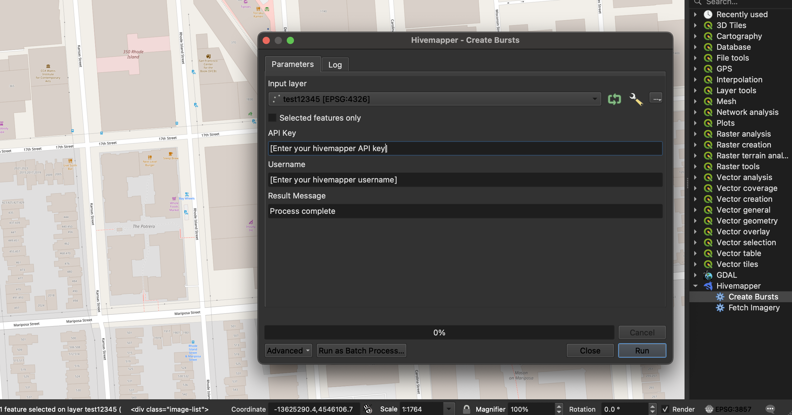

# Hivemapper Imagery QGIS Plugin

The **Hivemapper Imagery** plugin enables QGIS users to fetch and create imagery bursts directly within the QGIS environment. This guide walks you through the setup and installation process.

## Installation

1. **Clone or Download the Repository**  
   Clone or download the repository to your local machine.

2. **Run the Installation Script**  
   In the repository directory, set executable permissions for the installation script and run it:
   ```bash
   chmod +x install_hivemapper.sh
   ./install_hivemapper.sh
   ```
   The script will install required dependencies to the `extlib` directory.

3. **Copy the Plugin to QGIS Plugins Folder**  
   - Find your QGIS plugins folder by navigating to `Settings > User Profiles > Open Active User Profile Folder` in QGIS.
   - Copy the entire repository into the QGIS plugins folder (usually located at `profiles/default/python/plugins/` for the default user profile).

4. **Restart QGIS**  
   After copying the plugin, restart QGIS to load the new plugin.

5. **Activate the Hivemapper Imagery Plugin**  
   - In QGIS, go to `Plugins > Manage and Install Plugins`.
   - Search for "Hivemapper Imagery" and enable it by checking the box.

6. **Using the Plugin**  
   - Open the **Processing Toolbox** from the `Processing` menu.
   - You should see the Hivemapper plugin in the toolbox dropdown menu with options for "Fetch Imagery" and "Create Bursts."

7. **Enable Map Tips for Image Display**  
   - To view imagery associated with map points, enable Map Tips by going to `View > Show Map Tips`.
  
### Screenshot

#### Fetch Hivemapper Imagery

#### Show Imagery result (Hover over the point/polygon)

#### Create Burst


You're all set! The Hivemapper Imagery plugin should now be ready to use in QGIS, with full access to the imagery tools from the Processing Toolbox.